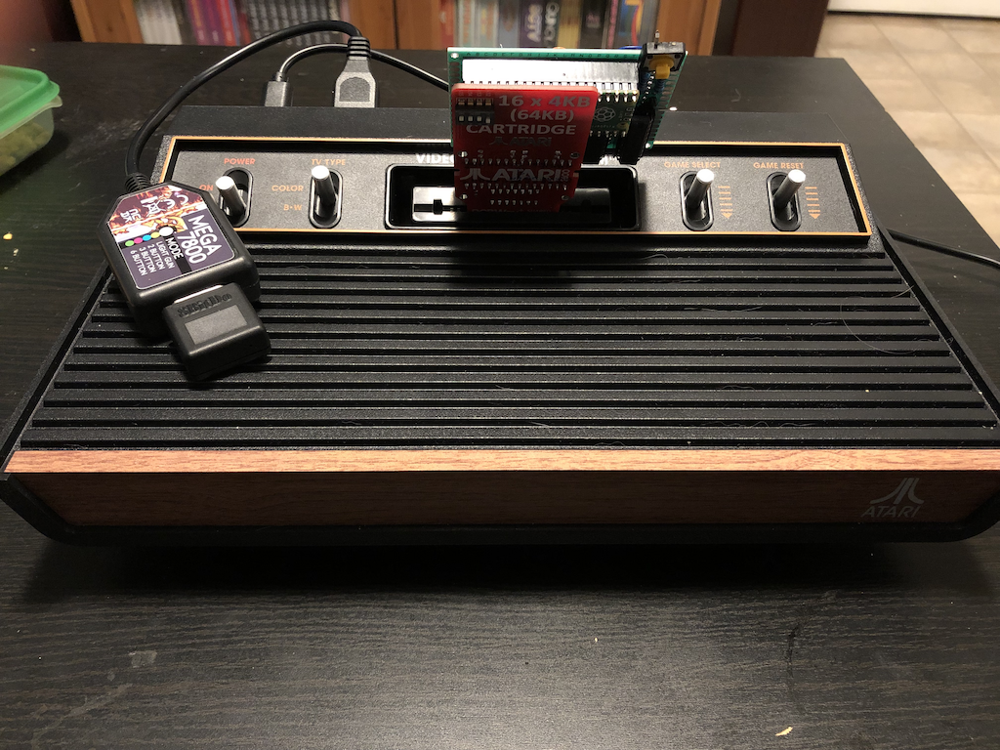
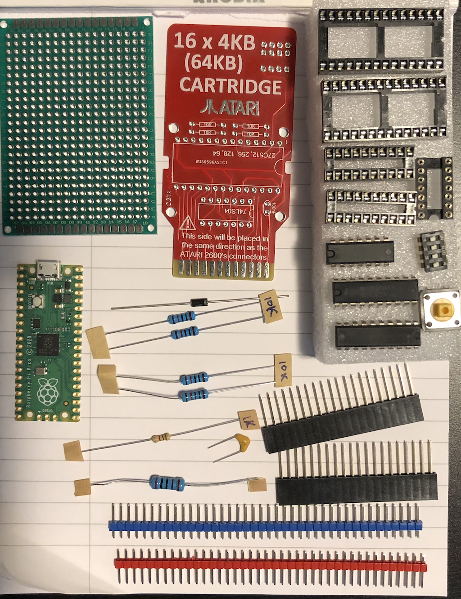

# atari2600cart
DIY Atari 2600+ Cart

Using a Raspberry Pi PICO to emulate a 28C256 32KB EEPROM which is then interfaced to an Atari 2600 cartridge card.

The ROM emulator is based on PicoROM (https://github.com/nickbild/picoROM) and the cartridge PCB is from https://www.pcbway.com/project/shareproject/ATARI_2600_MULTI_GAME_CARTRIDGE_PCB.html.

The cart allows for 16 different cartridges of 4K, 8K, 16K and 32K sizes with standard bankswitching.  A reset switch is wired, which allows for hot-swapping cartridges on the 2600+.

A helper script 'make_romheaders.py' is provided that will read in ROMS from the roms/ directory and create the necesssary roms_XX.h headers.

## Build Log

I'm going to put together a build walk through to help those that may want to create their own Pico Multi-Cart for the 2600+

### Required Materials

| Part | Description | Mouser Part Number |  
| ----- | ----------- | -------------------|   
| Raspberry Pi Pico | This build uses the non-wifi version |  358-SC0915 |  
| Protoboard        | Larger is okay.  There is barely enough room with the one I picked |  N/A |  
| Cartridge board   | I used this simple project from PCBWay to get a card interface | See intro for link |  
| SN74LS04N         | Hex Inverter | 595-SN74LS04N |  
| SN74LVC245AN x2 | Bus Transceivers Tri-State Octal Bus | 595-SN74LVC245AN |  
| 10 K ohm resistor x 4 | Generic resistors | N/A |  
| 1 K ohm resistor | Generic resistors | N/A |  
| 2 K ohm resistor | Generic resistors | N/A |  
| 1N4007 diode     | Diode | N/A |  
| 104 capacitor | 0.1uF ceramic capacitor | N/A |  
| Sockets and headers | These are optional, but recommended | N/A |  

